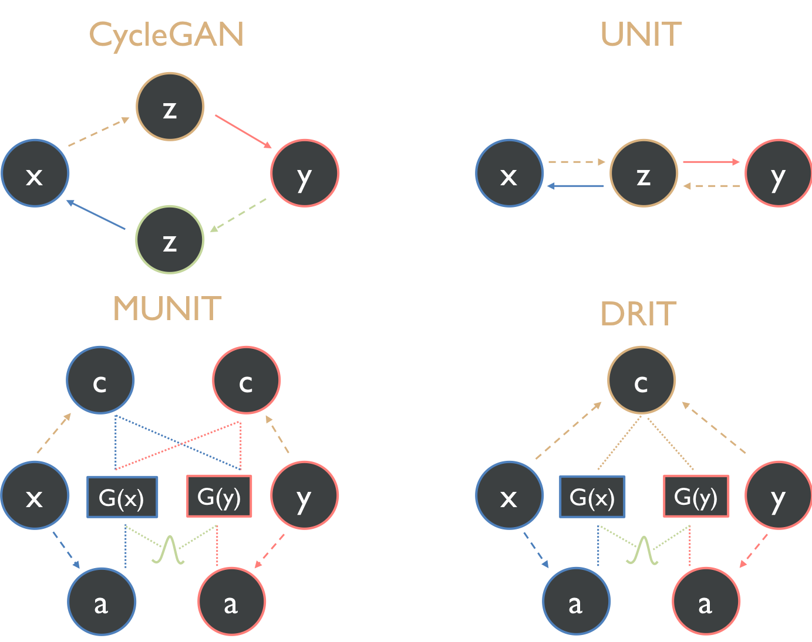
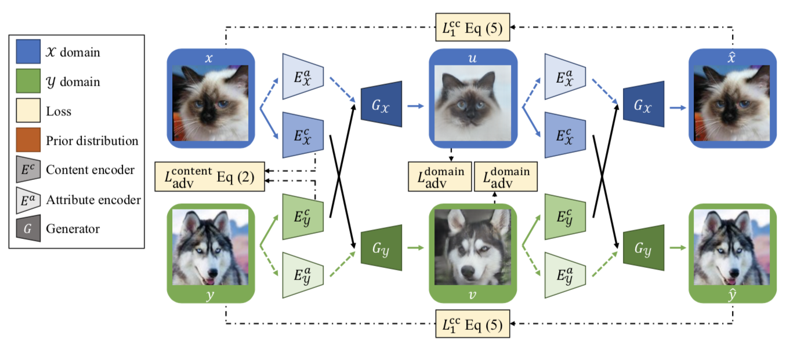
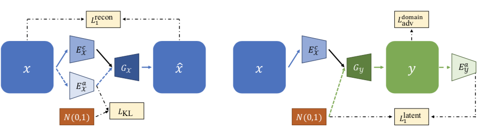
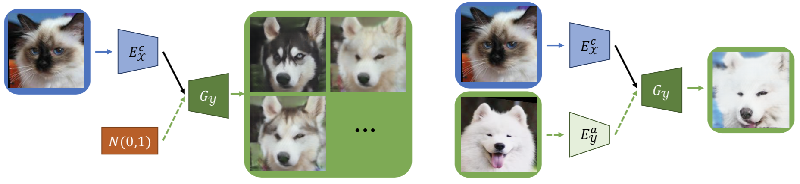
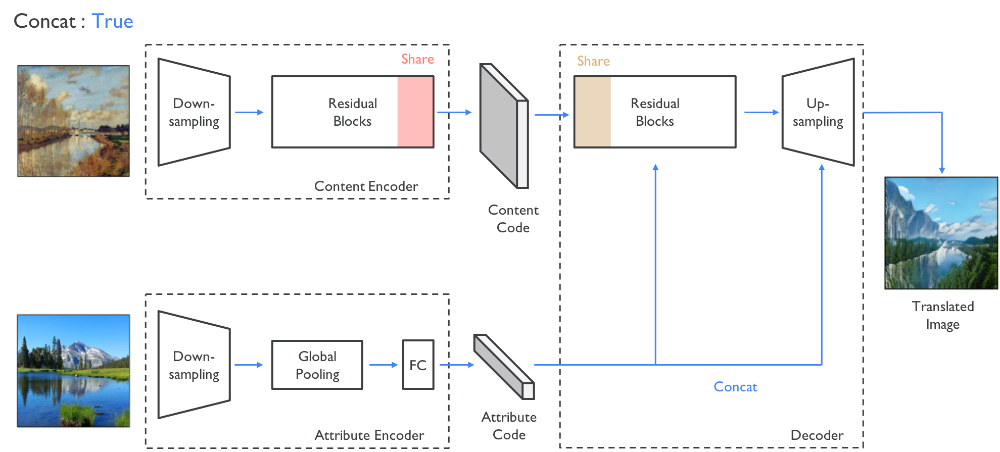
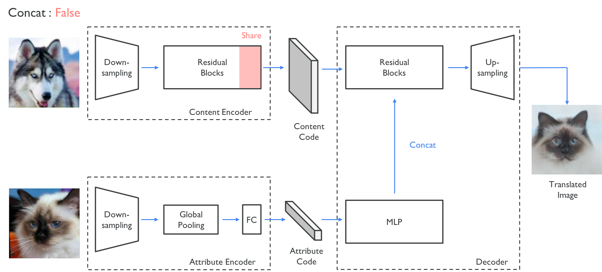
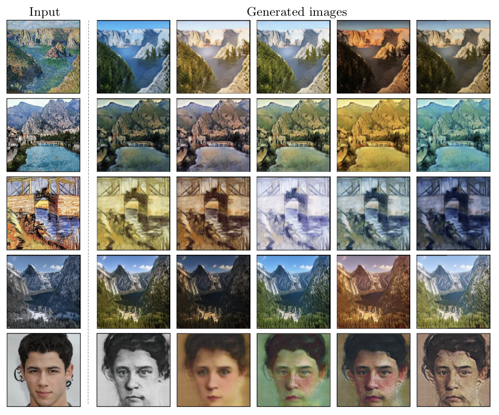

# DRIT-Tensorflow
Simple Tensorflow implementation of [Diverse Image-to-Image Translation via Disentangled Representations](https://arxiv.org/abs/1808.00948) (ECCV 2018 Oral)


## Requirements
* Tensorflow 1.8
* python 3.6

## Usage
### Download Dataset
* [cat2dog](http://vllab.ucmerced.edu/hylee/DRIT/datasets/cat2dog)
* [portrait](http://vllab.ucmerced.edu/hylee/DRIT/datasets/portrait)
* [CycleGAN](https://people.eecs.berkeley.edu/~taesung_park/CycleGAN/datasets/)

```
├── dataset
   └── YOUR_DATASET_NAME
       ├── trainA
           ├── xxx.jpg (name, format doesn't matter)
           ├── yyy.png
           └── ...
       ├── trainB
           ├── zzz.jpg
           ├── www.png
           └── ...
       ├── testA
           ├── aaa.jpg 
           ├── bbb.png
           └── ...
       └── testB
           ├── ccc.jpg 
           ├── ddd.png
           └── ...
           
├── guide.jpg (example for guided image translation task)
```
  
### Train
```
python main.py --phase train --dataset cat2dog --concat True
```

### Test
```
python main.py --phase test --dataset cat2dog --concat True
```

### Guide
```
python main.py --phase guide --dataset cat2dog --concat True --direction a2b --guide_img ./guide.jpg
```

### Tips
* --concat
  * `True` : for the **shape variation translation** (e.g., cat <-> dog) (default)
  * `False` : for the **shape preserving translation** (winter <-> summer)
  
* --n_scale
  * Using the `n_scale > 1`, a.k.a. `multiscale discriminator` often gets better results
  * Recommend `n_scale = 3` (default)
  
* --n_dis
  * If you don't the use multi-discriminator, then recommend `n_dis = 6`
  * If you use the multi-discriminator, then recommend `n_dis = 4` (default)
  
* --n_d_con
  * Author use `n_d_con = 3`
  * Model can still generate diverse results with `n_d_con = 1` (default)

## Summary
### Comparison


### Train phase



### Test & Guide phase


### Architecture



## Results



## Author
Junho Kim
